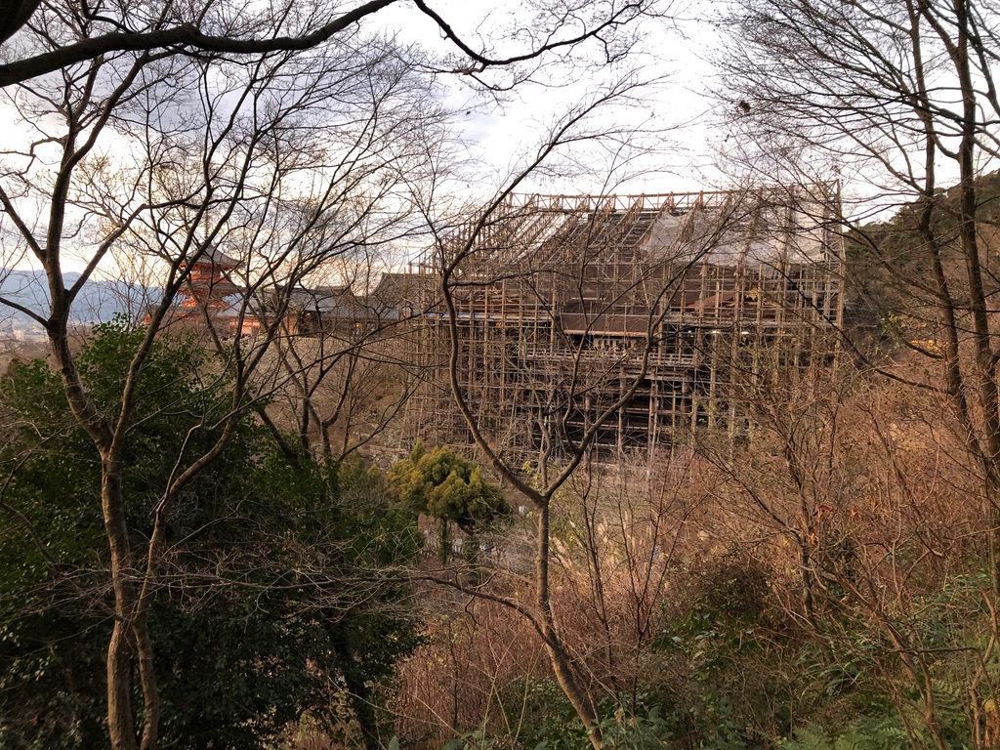
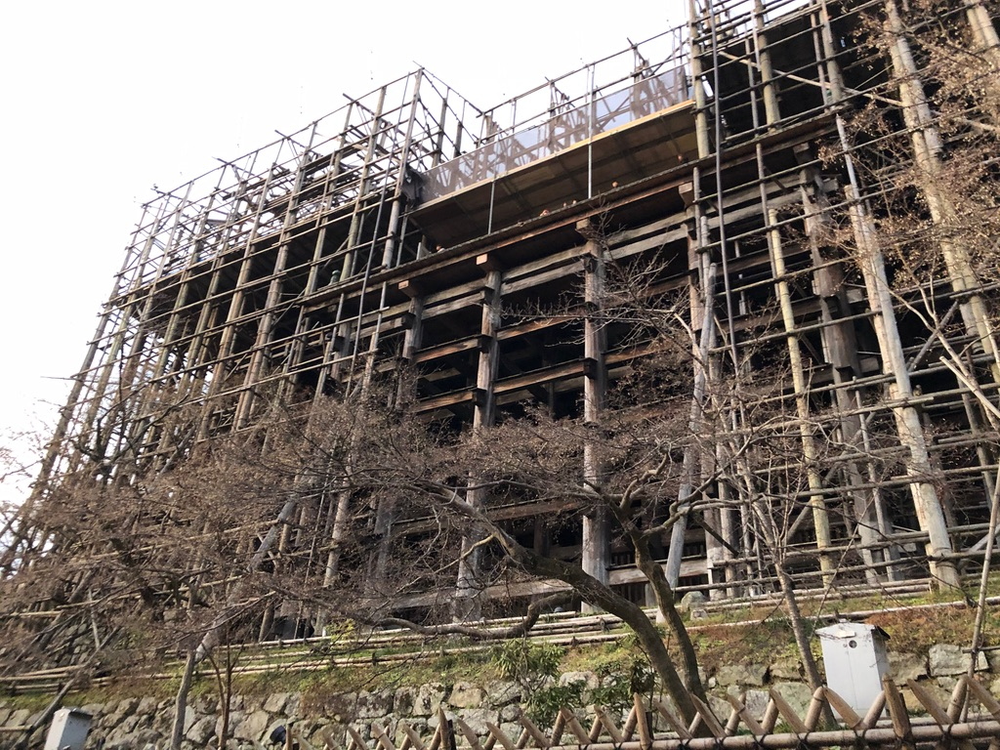
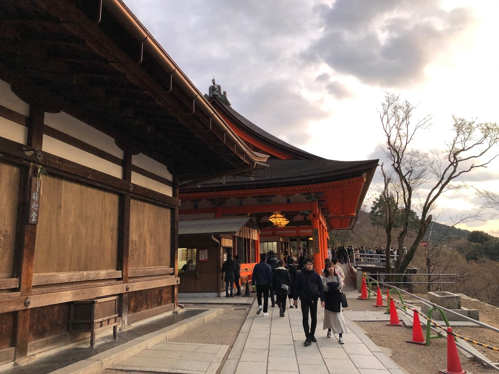
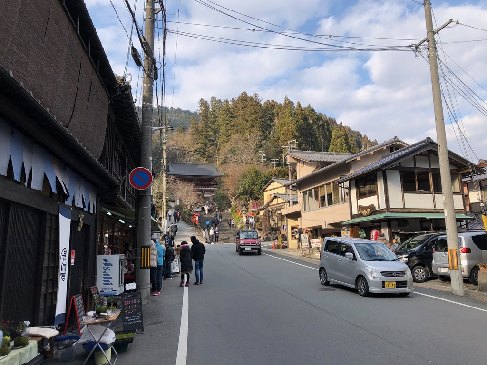
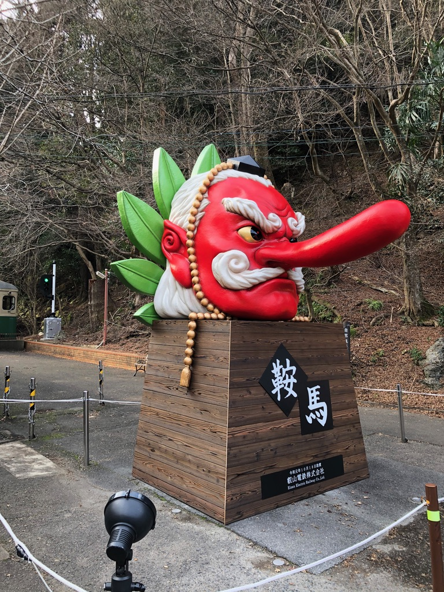
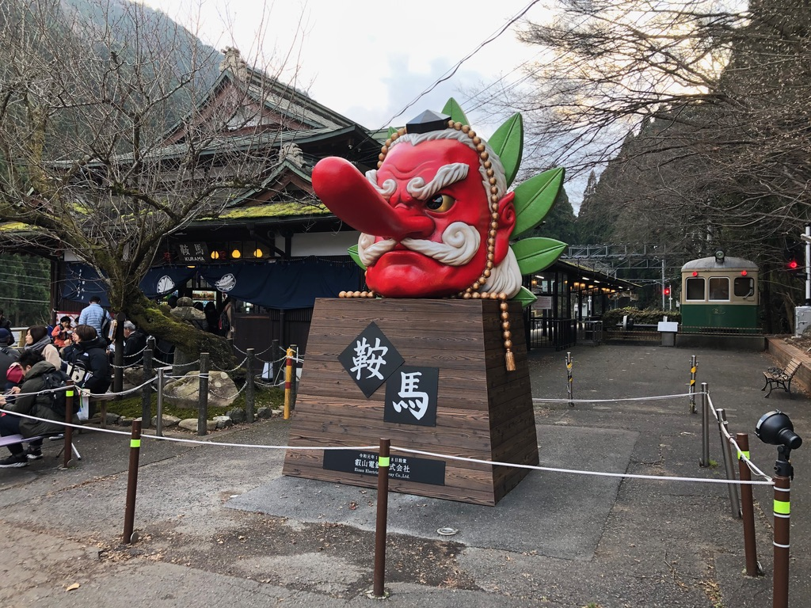
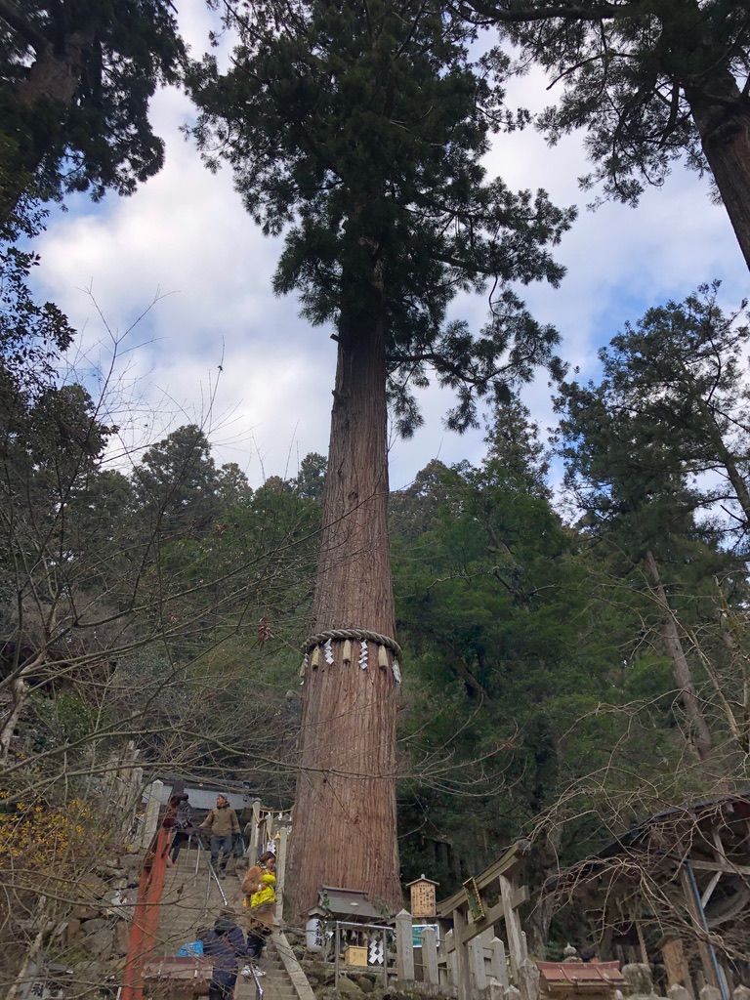
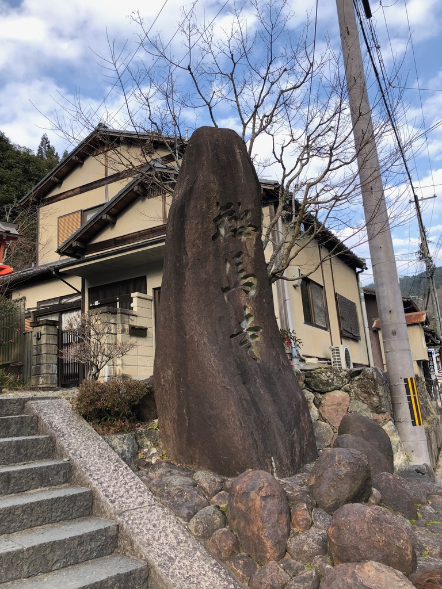
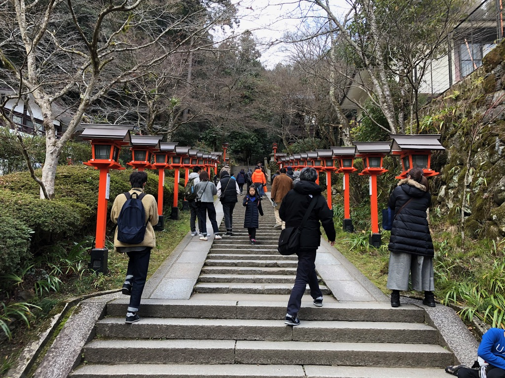
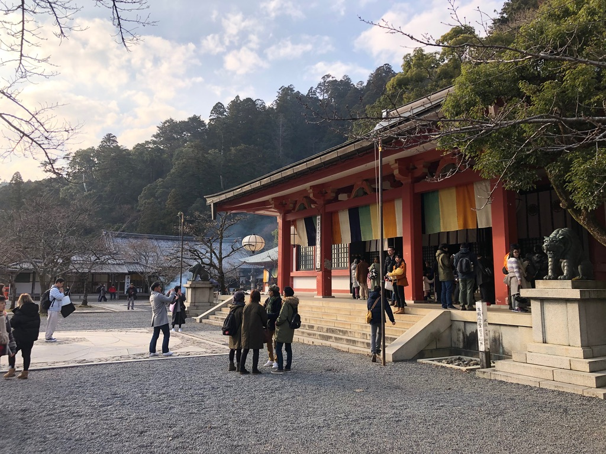

## 前言

翻到兩年前的照片，驚覺一場疫情讓時間就這麼停住了，於是邊看照片邊回憶，也希望明年可以一切回到常軌。

因為時間已經過去兩年了，很多記憶都可能散失了，所以如果有描述錯誤請見諒 m<( )>m

## 清水寺

來清水寺只因為同事的一句話

```
你以為下次再看到被鷹架圍住的清水寺時候你還走得動嗎？
```

所以就安排了這趟行程。硬要說的話，這趟旅程可能是清水寺之行吧xD

查了一下[別的文章](https://osaka.letsgojp.com/archives/70755/)，在寫這篇遊記的時候，清水寺的鷹架已經拆除了。

```
日本國寶級的世界遺產「清水寺」，在2017年春天起展開大規模整修，為東京奧運做準備。清水寺本堂鷹架在2020年3月拆除，並於12月整修完畢。美麗的清水寺在與世人暫別三年後終於強勢回歸！
```

當時覺得有鷹架的清水寺很難得，所以就拍了一堆鷹架照xDD 現在想起來也是有點好笑。








那天其實也沒幹嘛，就到處走走看看，像是換個地方散步而已。

## 鞍馬山

前往的路上。總覺得這在台灣會賣些小吃什麼的



鞍馬山的天狗居然換了!!! 比原本的那個小好多!!!











然後就看到神殿(?)了



大概就這樣，不過鞍馬山也是一個適合走走的景點。