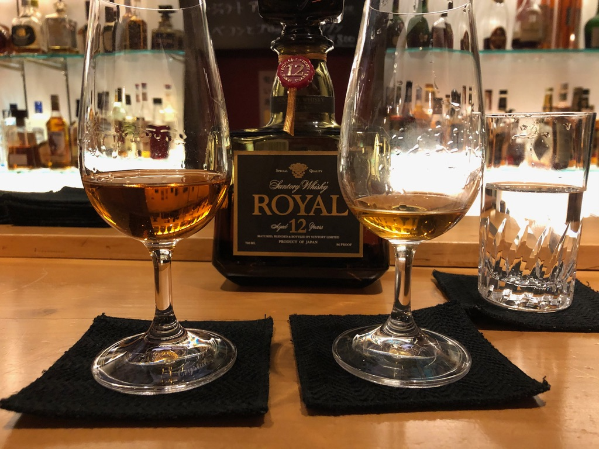
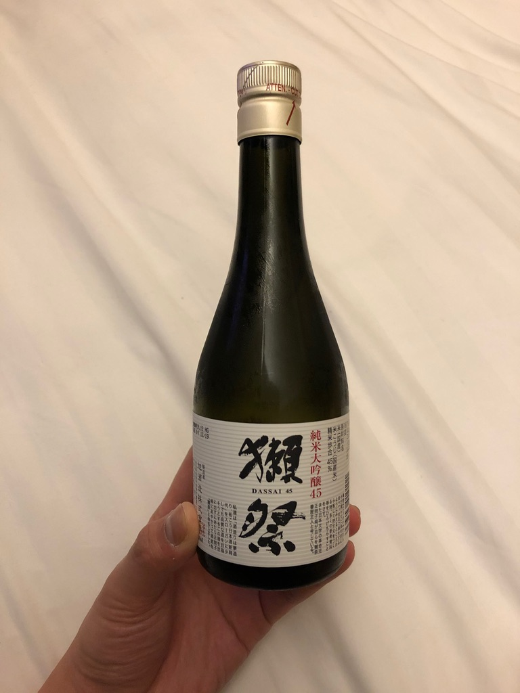
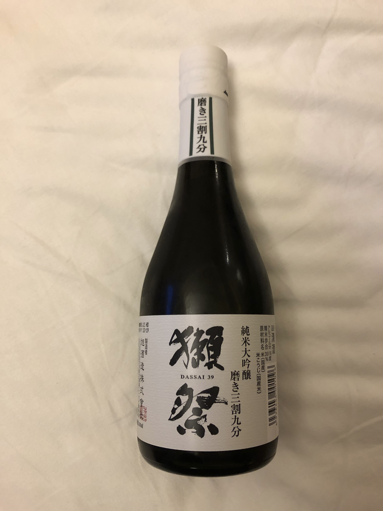

## 前言

作為一個愛酒人士(酒鬼)，去日本當然要喝酒了

## 酒的美術館

酒的美術館在日本各大城市都有分店。他有兩種型態，一種是販售老酒的店，另一種就是酒吧。

這趟兩種都有去。賣酒的店我是去清水寺附近的，裡面有很多滿棒的酒。感覺日本人也不太喝雅馬邑的酒，被我撿到好幾隻便宜的extra~~~~

另外就是酒吧了。剛好碰到高中好友也來這裡習醫，於是乎就與他把酒言歡。

## 獺祭

在日本另外一件事就是清酒特別便宜，當然也來喝一下很有名獺祭。我一直以為是籟祭...XD

一般來說大家常聽到的**二割三**、**三割九**都是所謂的**精米步合**，也就是一顆米保留多少的米心。如果是**二割三**，就是一顆米只留下中心的23%，**三割九**就是39%。

這次我買了**大吟釀45**跟**三割九**。以日本酒的傳統分級來說，大吟釀已經算是不錯的酒了。但喝起來還是稍嫌辣口。

三割九讓我非常驚艷。喝起來有水梨的口感，而且完全不辣口。推薦如果想求CP值的人可以試試看這款，大約是二割三6折，但跟45的差距非常有感！

