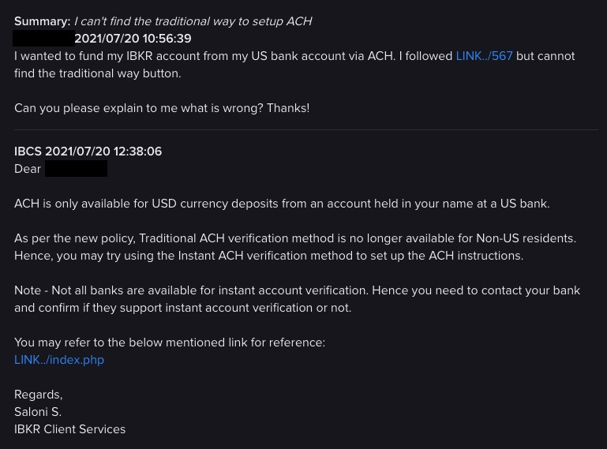
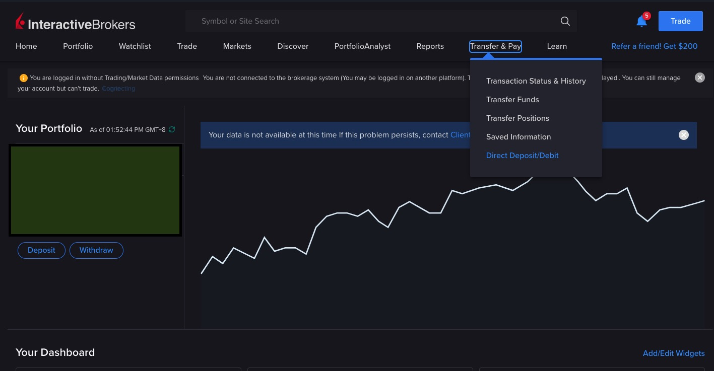
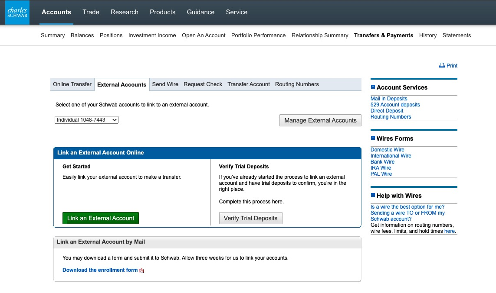
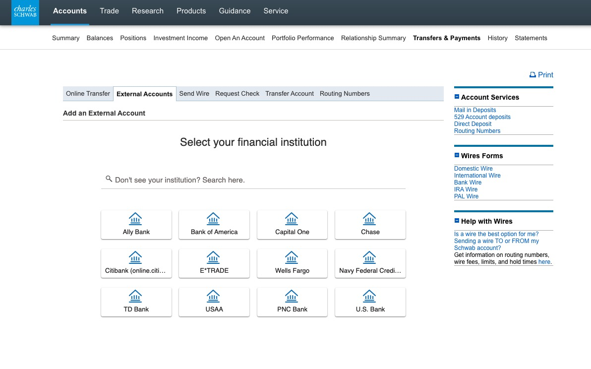
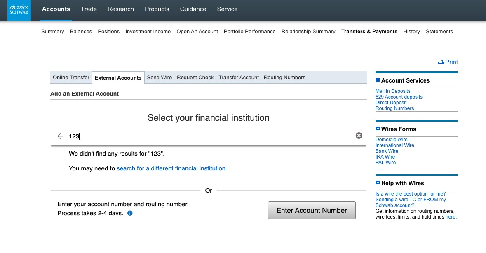
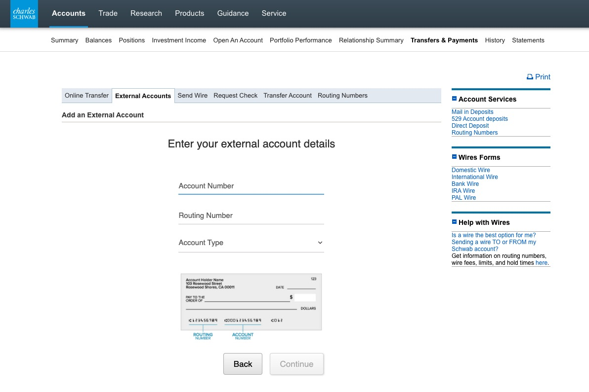

## 前言

玩美股的人玩了一陣子之後，可能都會有不止一家券商。但每家券商的優點又都不一樣，時間久了就有遷移資金的需求。

如果有在美國開戶，那透過該帳戶做轉帳可能是一個比較簡單的選擇。

但對於非美國籍的玩家來說，如果要透過**電匯**去轉移，手續費很貴(NTD 800起跳)。

與之相比通常免手續費的ACH就會是一個比較划算的選擇。

不過以整個手續所花的時間來說，**ACH最慢要3天**，但**電匯大概是1天內**。

## 名詞解釋

### ACH (Automated Clearing House)

用一句話解釋：一個低手續費或是零手續費的小額轉帳機制。

From [Wiki](https://en.wikipedia.org/wiki/Automated_clearing_house):
> An automated clearing house (ACH) is a computer-based electronic network for processing transactions,usually domestic low value payments, between participating financial institutions. It may support both credit transfers and direct debits. The ACH system is designed to process batches of payments containing numerous transactions and charges fees low enough to encourage its use for low value payments.

### 支票帳戶 Checking Account

在美國常見的帳戶類型有兩種
1. 支票帳戶 (Checking Account)通常是拿來做**日常使用**的帳戶
    * 刷卡、轉帳、開支票
    * 非常低或是沒有利息
    * 轉帳次數限制比較高，或是沒有限制
2. 儲蓄帳戶 (Savings Account)，類似定存
    * 存錢用
    * 轉帳或是提款次數很低
    * 利息通常高於Checking Account

目前Charles Schwab (嘉信)在開戶時可以申請支票，等同有個支票帳戶。

另方面Interactive broker也可以申請Checking Account，這邊稍後會提到。

## 如何設定

### Charles Schwab & TD Ameritrade

因為是CS有Checking Account，所以會是**從TD發動資金移轉**

拿到嘉信支票後，會在支票底部看到一行數字，分成3塊

> [Routing number] [Account number] [Seq. number]

接下來登入 TD Ameritrade的網站，點選 `我的帳戶 > 存款和轉帳> "帳戶/銀行綁定" > ACH > Connect now`

把支票上面的第一部分跟第二部分填到對應的欄位，送出。

接下來的幾天Charles Schwab會收到兩筆很小的金額 (通常是0.xx美元)，在TD這邊回覆該金額後就設定完成了。

### Charles Schwab & Interactive Broker

在今年以前，Interactive Brokers的可以直接綁定ACH，所以大致上的流程跟TD一樣。

但是今年開始似乎不開放給券商的Checking Account使用傳統的ACH認證方式。

但有發現IB也有Checking Account了，所以改成**從CS發動資金移轉**也可以。

登入IB後點選這個選項，接下來就一路照著指示走到最後，也一樣會拿到**Routing number**跟**Account number**

接下來登入Charles Schwab。

先到 `Account > Transfer & Payment > External Accounts`，點選Link。

在選取銀行的畫面上，隨便輸入幾個字

會看到`Enter Account Number`的按鈕

輸入IB拿到的**Routing number**跟**Account number**

Done.

接下來的幾天IB會收到兩筆很小的金額 (通常是0.xx美元)，在CS這邊回覆該金額後就設定完成了。